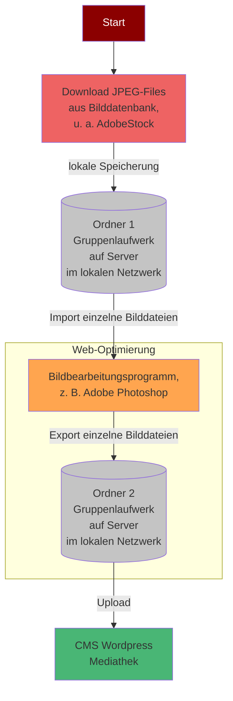
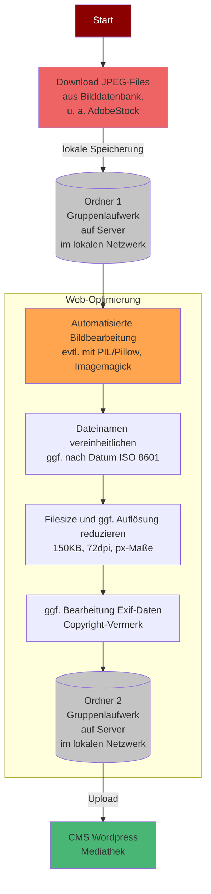

# Aufgabe MALIS 21.3 WPM_T9: Data Science / Data Librarianship / IT-Praxis

TH Köln
Studiengang: MALIS – Master in Library and Information Science
Modul: WPM_T9: Data Science / Data Librarianship / IT-Praxis
Dozent_in: Konrad Förstner

Vorgelegt von: 
Ariane Larrat
Zentrum für Lehrentwicklung (ZLE), TH Köln

Sommersemester 2022
Abgabedatum: 21.05.2022
ariane_johanna.larrat@th-koeln.de

# Aufbereitung einer digitalen Bildsammlung als Webcontent

## 1. Ausgangslage

Die vorliegende Ausarbeitung versteht sich als Beitrag zur computergestützen Aufbereitung einer digitalen Dateisammlung als Webcontent. Webcontent kann definiert werden als "the stuff in your website", u. a. also "images, audio und video files" (Morville & Rosenfeld, 2006).

Das Anwendungsbeispiel, das nachfolgend als Grundlage dient, sei kurz umrissen:

Infolge der COVID-19-Pandemie wurden am Zentrum für Lehrentwicklung (ZLE) der TH Köln zahlreiche Materialien und Ressourcen zusammengestellt, um Lehrende bei der Umsetzung digitaler und/oder hybrider Lehr-Lern-Settings zu unterstützen. Diese Materialien sollen nun in einem webbasierten Informationsangebot aggregiert werden. Die Inhalte werden den Nutzer_innen mithilfe des Content Management Systems (CMS) WordPress zur Verfügung gestellt und über die grafische Benutzerfläche veröffentlicht.

Neben Text- und Videofiles liegen in diesem Kontext vor allem Bilddateien als unstrukturierte Dateisammlung vor, die in einer nicht näher definierten Ordnung in einem Verzeichnissystem (Gruppenlaufwerk des ZLE) abgelegt sind. Diese Dateien sollen zur Veröffentlichung über die grafische Benutzeroberfläche als Webcontent aufbereitet werden. Um die Prozessschritte einer entsprechenden "Aufbereitung" festzulegen, sollen zunächst die Problemfelder und der Ausgangsprozess beschrieben werden.

## 2. Problemstellung

Bilddateien ohne Aufbereitung im Web zu nutzen, birgt - wie auch im vorliegenden Beispiel - einige Probleme, die vor allem in folgenden Charakteristika begründet liegen:

* Größe: Nicht nur die unübersichtliche Anzahl an Einzeldateien ist u. U. problematisch, sondern auch die Dateigrößen gängiger Bildformate (im vorliegenden Beispiel insb. .jpeg, .jpg & .png). Eine verlustfreie Komprimierung der Dateien im selben Dateiformat ist dabei nicht ohne weiteres möglich.
* Performance: Die Größe der im Beispiel vorliegenden Bilddateien (bis zu 6MB) hat ebenfalls erhebliche Auswirkungen auf die Performance/Ladegeschwindigkeit einer Website. Eine schnellere Ladezeit wirkt sich positiv auf die User Experience (UX) potentieller Nutzer_innen, das Suchmaschinenranking und im Idealfall die Conversions aus. Zudem sollten einzelne Webpages eine gewisse Größe nicht überschreiten, sodass große Bilddateien direkte, negative Auswirkungen hätten. Die Bildgröße für Websites sollte folglich bei max. 150 KB liegen (Wengenroth, 2019)
* Ablage/Mediathek: Die Verwaltung der Bilddateien im CMS selbst (in der WordPress-Mediathek) kann durch eine unstrukturierte Ablagestruktur und fehlende Benennung erschwert werden, die weder standardisiert, noch thematisch organisiert ist.
* Metadaten: Unzureichende Metadaten in Bilddateien können zu (rechtlichen) Problemen führen, u. a. durch fehlende Copyright-Vermerke. Dabei sollten die Metadatenstandards zur Speicherung von Bildinformationen berücksichtigt werden, insb. Exif.

## 3. Ausgangsprozess

Um mögliches Optimierungspotential in der Aufbereitung des Bildmaterials als Webcontent zu identifizieren, soll zunächst beschrieben werden, wie die Bildsammlung bisher für die Veröffentlichung über das o. g. CMS vorbereitet wurde. Damit dieser Prozess nachvollzogen werden kann, ist ein Blick auf die Entstehung der Bildsammlung vonnöten. Die darin enthaltenen Bilddateien setzen sich insb. zusammen aus:

* Screenshots als .png-Dateien, die durch Mitarbeitende des ZLE erstellt wurden (v. a. Bildschirmaufnahmen von digitalen Tools, die für die Hochschullehre eingesetzt werden können.)
* Logo-Dateien, die von verschiedenen Quellen heruntergeladen wurden.
* Header-Dateien und s. g. "Schmuckbilder", die das Design der Website abbilden und zumeist aus Bilddatenbanken wie z. B. AdobeStock stammen.

Die Bilddateien wurden (nach erfolgter Erstellung oder Download) von Mitarbeitenden des ZLE ohne die Verwendung spezieller Software abgelegt. Als Ablageort diente bisher ein Ordner im Gruppenlaufwerk "ZLE-CLOUD". Um die Originalbilder vor dem Upload zu optimieren, wurden diese zuvor mit einem Bildbearbeitungsprogramm (insb. Adobe Photoshop) bearbeitet. Als Kriterien zur Konvertierung und Weboptimierung dienten dabei folgende Punkte:

* Dateigröße max. 150 KB
* Bildauflösung/Punktdichte 72 dpi
* Maße
    * für Header 1200 x 630 px
    * für Logos 200 x 200 px
    * für Thumbnails 150 x 150 px

Eine Umwandlung in ein web-geeignetes Bildformat wie WebP, AVIF oder JPEG XR ist bis dato nicht erfolgt. Gerade bei sehr großen Bildern, wie dem s. g. "Header" war es jedoch bisher schwierig, in der Formatierung ein gutes Gleichgewicht zwischen der Dateigröße und der Qualität zu finden. Insbesondere bei der "lossy compression" (Rabbani& Jones, 1991, S. 6).leidet durch eine Verringerung der Farben und der Auflösung u. U. die Bildqualität, wenngleich im Idealfall deutlich Dateigröße eingespart werden kann.
Im Anschluss an die o. g. Bearbeitung der Bilder hinsichtlich der Dateigröße, der Bildauflösung und der Bildmaße wurden die Dateien erneut in das Gruppenlaufwerk "ZLE-CLOUD" gelegt, jedoch in einen zweiten, separaten Ordner. Von diesem lokalen Ordner aus wurden die Dateien schließlich in die Mediathek des CMS hochgeladen.

## 4. Optimierter Prozess

Wesentliches Ziel der Optimierung des Prozesses ist es, den in Kapitel 3 beschriebenen Ausgangsprozess der Weboptimierung der Bildsammlung zu automatisieren. Mithilfe eines entsprechenden Python-Moduls bzw. der entsprechenden Libary könnte die Interaktion mit den Bilddateien erheblich erleichtert werden. So verfügt bspw. "Pillow" über mehrere Funktionen, die es vereinfachen, den Inhalt eines Bildes zuzuschneiden, zu ändern oder es zu bearbeiten (Sweigart, 2015).

*Edit von Florian*: Eventuell bietet sich auch eine Nutzung einfacher Shell-Skripte in Verbindung mit ImageMagick an. Konvertierung sowie Komprimierung sind keine besonders anspruchsvollen bzw. erhebliche Vorkenntnisse voraussetzende Arbeitsvorgänge in solch einem Prozess. 

Nachfolgend sollen die nicht die Skripte bzw. Programme ausformuliert werden, sondern lediglich zusammengefasst werden, was die Software im besten Fall leisten könnte:

* Dateinamen vereinheitlichen: Das Programm sollte zunächst eine Liste aller Dateien in dem ausgewählten input-Ordner und allen Unterordnern erstellen. Bearbeitet werden sollten nur .jpg, .jpeg und .png Dateien. Zunächst sollten die Metadaten der Datei ausgelesen werden und es sollte versucht werden, das Downloaddatum oder ggf. das Aufnahmedatum des Bildes zu ermitteln. Sollte das Downloaddatum vorhanden sein, wird die Datei kopiert und mit dem Downloaddatum als Dateinamen im Format YYYYMMDD_hhmmss gespeichert. Zusätzlich sollten alle Dateien, die im Dateinamen "Header" oder "Logo" enthalten mit dem entsprechenden Zusatz YYYYMMDD_hhmmss_logo oder YYYYMMDD_hhmmss_header gespeichert werden. Alle Dtaeien werden im angegeben output-Ordner mit einem eindeutigen Namen gespeichert. Wenn zeri Bilder den selben Namen erhalten würden, wird keine Datei überschrieben, sondern die Namen mit\_2, \_3, ... erweitert. 
    * *Edit von Florian*: Eine zusätzliche, ruhig einfach gehaltene Verschlagwortung der Dateien macht das Anfügen bestimmter Endungen überflüssig und kann später dabei helfen die Bilddateien schneller und zielgerichteter zu durchsuchen.
* Filesize reduzieren: Das Programm sollte zuerst eine Liste aller Dateien in dem ausgewählten input-Ordner und allen Unterordnern erstellen. Wenn es sich bei einer Datei um ein .jpg, .jpeg oder .png-Format handelt, dann wird dieses in der angegebenen Qualität (mit Angabe der Dateigröße, Bildauflösung und -maße) im Output-Ordner gespeichert. Die Originaldateien bleiben dabei immer unverändert. Alle anderen Dateien werden ohne Änderungen im angegebenen Output-Ordner mit einem eindeutigen Namen gespeichert. Wenn zwei Bilder den selben Namen erhalten würden, wird keine Datei überschrieben, sondern die Namen mit _2, _3, ... erweitert.
* ggf. Bearbeitung Exif-Daten: Das Programm sollte das Ausfüllen nicht verwendeter Exif-Tags ermöglichen, insb. "Copyright" (mithilfe eines entsprechenden Python-Moduls, das auf die Exif-Daten in digitalen Fotos zugreifen kann, z. B. das Exif-Modul). Das Copyright sollte in einer standardisierten Form angegeben werden. 

Über die o. g. Punkte hinaus gilt es zu prüfen, ob eine Konvertierung in Dateiformate wie WebP, AVIF oder JPEG XR zielführend ist, da diese Bildformate zwar eine Reihe vielversprechender Potentiale bieten, jedoch nicht von allen Browsern unterstützt werden (vgl. https://caniuse.com/?search=webp). Durch eine Konvertierung könnten einige Prozessschritte wie die Reduzierung der Filesizes teils entfallen.

Anschließend an den optmierten Prozess sollten die Bilddateien aus dem entsprechenden Ordner im Gruppenlaufwerk wieder in das CMS hochgeladen werden.

*Edit von Florian*: Es könnte auch überlegt werden, die fertigen Bilddateien auf eine plattform-/softwareunabhängige Cloud oder Repositorium zu schieben. So bleibt die Mediathek auch bei einem Wechsel des CMS bzw. einer Umstellung auf selbst geschriebenen Websites erhalten. Alle gängigen CMS verfügen auch über die Möglichkeit online gehostete Bilder einzubinden.

# Vorteile

Der beschriebene Workflow zur Aufbereitung einer digitalen Bildsammlung ergab sich - wie in Kapitel 2 beschrieben - aus dem Umstand, dass vermieden werden sollte, mit sehr großen Bilddateien als Webcontent Probleme zu verursachen, die sich nachteilig auf die Usability der anvisierten Website auswirken. Einige der eingeschlagenen Wege gilt es sicherlich zu prüfen, da sie u. U. nicht zielführend sind. Mit der Hinwendung zu Python soll ein Weg gewählt werden, der ein großes Maß an Effizienz und Flexibilität in der Aufbereitung einer digitalen Bildsammlung als Webcontent ermöglicht. Dadurch ergeben sich für die Website weitere Vorteile, u. a. dass die Erstellung von Backups beschleunigt werden kann, kleinere Bilddateigrößen weniger Bandbreite verbrauchen und weniger Speicherplatz auf dem Server benötigt wird. Wenngleich also der Aufwand zur Automatisierung des Aufbereitungsprozesses nicht von der Hand zu weisen ist, überwiegen doch die Vorteile - insbesondere dann, wenn ein webbasiertes Angebot wie die o. g. Website kontinuierlich an Volumen hinzu gewinnt.

### Literatur- und Quellenverzeichnis

    Morville, P. & Rosenfeld, L. (2006). Information Architecture for the World Wide Web (3. Aufl.). O'Reilly Media.

    Rabbani, M. & Jones, P. W. (1991). Digital Image Compression Techniques. Spie Optical Engineering Press.
    
    Sweigart, A. (2015). Automate the Boring Stuff with Python. Online verfügbar unter https://automatetheboringstuff.com [zuletzt abgerufen am 10.05.2022]

    Wengenroth, W. (2019). 111 SEO Tipps. Der Ratgeber zur erfolgreichen Suchmaschinenoptimierung. Ebozon Verlag.

